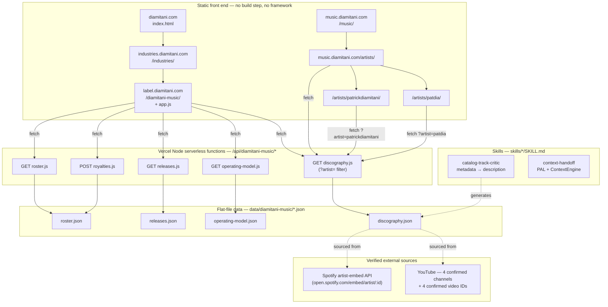

# Diamitani Music — Project Blueprint

**Status:** built, tested locally, not yet deployed live (see § Deployment)
**Repo:** `diamitani/Diamitani-Industries`
**Branch / PR:** `cursor/diamitani-music-portfolio-company-17de` → [PR #1](https://github.com/diamitani/Diamitani-Industries/pull/1) (draft, targets `main`)
**Related:** `handoff/context-manifest.json` (machine-readable state), `handoff/TRANSCRIPT.md` (full session record)

---

## 1. What Diamitani Music is

Diamitani Music is a **portfolio company** of Diamitani Industries, Inc. —
a label / publishing / artist-services holding, distinct from the personal
artist page at `music.diamitani.com` (Pat Dia's own tracks/channels). It's
a small real web app with a real backend, not a marketing page:

- A **label operating system** (`/diamitani-music/`, `label.diamitani.com`)
  — roster, catalog, an operating-model flow, and a live royalty &
  recoupment calculator.
- A **catalog & artist layer** (`music.diamitani.com/artists/*`) — a
  verified, sourced discography for the two artist identities in the
  catalog (Pat Dia; Patrick Diamitani), each with real streaming embeds and
  critic-style track notes.
- A **skill layer** (`skills/*/SKILL.md`) — the reusable agent processes
  that generate the catalog's metadata and descriptions, so the work
  compounds instead of being one-off copywriting.

## 2. Architecture

## 3. Site map

| URL | File | What it does |
|---|---|---|
| `diamitani.com` | `index.html` | Corporate home — 5 division cards (incl. Diamitani Music), holdings grid, metrics |
| `industries.diamitani.com` | `industries/index.html` | Portfolio companies directory — includes the Diamitani Music card |
| `label.diamitani.com` | `diamitani-music/index.html` + `app.js` | The label app: Roster, Catalog, **Artists**, Operating Model (+ calculator), Services |
| `music.diamitani.com` | `music/index.html` | Personal artist landing (Pat Dia's own tracks) — links out to the Artists directory |
| `music.diamitani.com/artists/` | `music/artists/index.html` | Artist directory (2 cards) |
| `music.diamitani.com/artists/patdia/` | `music/artists/patdia/index.html` | Full profile: Spotify + YouTube embeds, 5 track notes, links |
| `music.diamitani.com/artists/patrickdiamitani/` | `music/artists/patrickdiamitani/index.html` | Full profile: Spotify embed, 10 track notes + 1 flagged single, links |

All pages share `assets/theme.css` — one design system, per-division accent
color via `body[data-division="..."]` (`label` = emerald `#34d399`,
`music`/artist pages = rose `#f472b6`).

## 4. Backend — `/api/diamitani-music/*`

Zero-config Vercel Node serverless functions. No external database, no
secrets, no framework — each file is a plain `module.exports = (req, res) => {...}`
reading a JSON file under `data/diamitani-music/`.

| Method | Endpoint | Purpose |
|---|---|---|
| `GET` | `/roster` | Signed/scouted artists, split profiles, advance balances |
| `GET` | `/releases` | Release catalog, joined to artist name |
| `GET` | `/operating-model` | Sign → Release → Collect → Split & Recoup → Reinvest flow + services |
| `POST` | `/royalties` | `{artistId, revenue}` → split + recoupment breakdown (stateless) |
| `GET` | `/discography` | Full multi-artist discography, `?artist=<slug>` to filter |

`vercel.json` maps `label.diamitani.com` → `/diamitani-music`, and — this
matters — **every** host rewrite rule excludes `api/` (and `assets/`) so
the serverless functions resolve on every subdomain, not just the label's.

## 5. Data model (flat files, no DB)

- `roster.json` — `{id, name, role, genre, status, splitProfile:{artist,label,producer}, advanceBalance}`
- `releases.json` — `{id, title, artistId, type, released, status, links}`
- `operating-model.json` — `{flow:[{stage,detail}], services:[{name,detail}]}`
- `discography.json` — two artist entries (`pat-dia`, `patrick-diamitani`), each with `spotifyArtistId`, `youtube` channel links, `otherLinks`, and a `tracks[]` array where every track has `{id, title, duration, order, youtubeVideoId, confidence, description, tags}`.

**`confidence` is the load-bearing field.** Every track today is
`"metadata-informed"` — the description was generated from title, duration,
and tracklist position, *not* an audio listen (no audio-analysis tool was
available when this was built). Nothing claims to have heard a track it
hasn't. See `skills/catalog-track-critic/SKILL.md` for the exact rule and
how to upgrade a track to `"listened"`.

## 6. Skills & prompt library

| Skill | Does what | Lives at |
|---|---|---|
| `catalog-track-critic` | Extracts catalog metadata, writes a critic-voice track description, flags confidence honestly, never invents a platform ID | `skills/catalog-track-critic/SKILL.md` |
| `context-handoff` | Turns any agent session into a portable, resumable context package for a different agent/chat/platform — implements ROSTR's PAL (5-stage compiler → structured manifest) + ContextEngine (flat-file session memory) | `skills/context-handoff/SKILL.md` |

Generalized, reusable version of the handoff pattern (for any project, not
just this one): `prompts/context-handoff-one-sheet.md`, indexed in
`prompts/README.md`.

## 7. Verified facts this catalog is built on

Sourced directly from Spotify's artist-embed API (`open.spotify.com/embed/artist/:id`) — not search speculation:

- **Pat Dia** (`1ioo8TqdBc8RIzvSYkUS1y`) — Go West Young Man, Sunshine, Sway, Deep, Harp About It. 4 of 5 already have confirmed YouTube video IDs (from the site's pre-existing embeds).
- **Patrick Diamitani** (`0N3LRUvTtIok9S9z45ONvQ`) — a 10-track instrumental beat tape, Believe in Everything → There We Go. No YouTube video IDs confirmable this session — none guessed.
- 4 YouTube channels confirmed to exist and linked: Pat Dia - Topic, Patrick Diamitani - Topic, Patrick Diamitani Music, Delaly Records.
- No Pandora profile verified for either name — intentionally omitted rather than guessed.

## 8. Testing performed (no live deploy yet — see § 9)

- `JSON.parse` on every data file, `node --check` on every JS file.
- A throwaway local Node HTTP server mimicking Vercel's static + serverless routing, used to `curl` every endpoint directly (happy path + error paths: 404 unknown artist, 400 bad revenue, 405 wrong method).
- A `jsdom` pass (dev-only, not a project dependency) that actually executes each page's front-end JS against the live local API with a `fetch` polyfill and asserts real DOM state (track counts, embed counts, link counts) — not just "it didn't crash."
- Python `html.parser` well-formedness check on every HTML file; `vercel.json` re-validated as JSON after every edit.
- **This session:** installed `puppeteer-core` pointed at the sandbox's existing Chrome binary, actually rendered the pages in a real headless browser against the local server, and confirmed visually that fonts, layout, the live Spotify embed (real album art, real track list), and the operating-model calculator all render correctly.

## 9. Deployment

**Nothing here is live yet.** This repo has no Vercel project connected —
confirmed by checking PR #1 for a Vercel bot status check/comment (none
found) and by attempting `vercel whoami` in this environment (no
`VERCEL_TOKEN` or other Vercel credential is configured here; the CLI fell
back to an interactive browser OAuth flow, which a cloud agent can't
complete).

**To actually deploy, one of these needs to happen:**

1. **Manual one-time import (no agent credentials needed):** In the
   [Vercel dashboard](https://vercel.com/new), import
   `diamitani/Diamitani-Industries` as a new project (static site — Vercel
   auto-detects the `api/` folder for the serverless functions, no build
   command needed). Then in **Project → Settings → Domains**, add all 6
   domains from `README.md` § Deploy. Once connected via the GitHub
   integration, every future push to this branch/PR will get an automatic
   Vercel preview URL, and merges to `main` will deploy to production.
2. **Or, give a future agent run deploy access:** add a `VERCEL_TOKEN`
   secret (and, if the project already exists, `VERCEL_ORG_ID` +
   `VERCEL_PROJECT_ID`) in **Cursor Dashboard → Cloud Agents → Secrets**.
   With those present, an agent can run `vercel --token=$VERCEL_TOKEN
   deploy` (preview) or `--prod` directly from this repo and report back a
   real, live URL.

## 10. Open items / roadmap

See `handoff/context-manifest.json` → `openItems` for the full prioritized
list (and `handoff/NEXT_STEPS_PROMPTS.md` for ready-to-paste prompts for
each). Headline items:

- Confirm YouTube video IDs for Patrick Diamitani's 10 tracks (currently all `null`).
- Confirm the "Go West Young Man" video ID for Pat Dia.
- Upgrade track descriptions from `metadata-informed` to `listened` once real audio-analysis access exists.
- Deploy (§ 9) and re-verify every endpoint/page live.
- PR #1 review pass — still an open draft.
